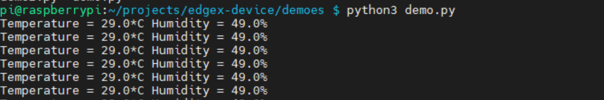

# DEMO-RPI-EDGE-DEVICE with celery
last update - 2021.08.11
* * * 

#### 프로젝트 구조

```
demo-rpi-mqtt
├ custom-config
│  ├ devices
│  │  ├ led.test.device.config.toml     # 데이터 수집 장치 정의
│  │  └ rpi.test.device.config.toml     # 제어 장치 정의
│  └ profiles
│     ├ led.test.device.profile.yml     # 데이터 수집 장치 프로파일 정의
│     └ rpi.test.device.profile.yml     # 제어 장치 프로파일 정의
├ demoes
│  ├ demo.py            # DHT11 센서 데이터 수집 및 MQTT 발행 코드
│  └ demoe2.py          # MQTT 수신 및 명령어에 따른 LED 제어 코드
├ src
│  ├ dhtAgent.py        # celery 적용이 용이하도록 DHT11 데모 코드를 클래스화 
│  └ ledAgent.py        # celery 적용이 용이하도록 LED 데모 코드를 클래스화 
├ main.py               # celery task 동작 코드
├ tasks.py              # celery task 정의 코드 
├ requirements.txt      # 의존 모듈 정의
└ ...
```


* * *
# 구성

+ EdgeX Framework 실제 적용 데모 - Collecting Data (DHT11 sensor)
+ EdgeX Framework 실제 적용 데모 - Cotrolling Actuator (LED)
+ 비동기 분산 큐 처리 (celery 기반)

* * *
## EdgeX Framework 실제 적용 데모 - 데이터 수집

본 데모에서는 라즈베리파이3 B+를 사용하여 DHT11 센서에서 측정하는 온도 및 습도 값을 수집하고 EdgeX Framework에 연결하는 내용을 수행한다. 

1. DHT11 센서 수집 코드 작성
2. EdgeX의 metadata에 Device Profile 등록(yml파일)
3. 등록된 Device Profile에 기반하여 EdgeX의 metadata에 Device 등록(toml파일)
4. REST API를 통해 수집 데이터 및 등록 정보를 확인

#### DHT11 센서 수집 코드 작성
라즈베리 파이에서 동작시킬 코드는 현 프로젝트에서 [./demoes/demo.py](demoes/demo.py)에 위치하고 있다. 


```bash
$ mosquitto_sub -t '#' -h (broker-host) -p (broker-port) -v
```


#### EdgeX에 Device profile 및 Device 등록

EdgeX에 디바이스 Profile을 등록하는 방법은 3가지가 있다.
+ profile 폴더에 {{profile}}.yml을 넣은 뒤 ```docker run```시 적용 (데모에서 사용한 방법)
+ API로 Profile 정보를 등록(.json 파일 형식)
+ API로 Profile 정보를 등록(body 입력 형식)


본 데모에서는 첫번째 방법을 통해 Profile을 등록한다.
```yaml
...
    environment:
      ...
      # custom-config
      DEVICE_DEVICESDIR: /custom-config/devices
      DEVICE_PROFILESDIR: /custom-config/profiles
      MQTTBROKERINFO_HOST: xxx.xxx.xxx.xxx
      MQTTBROKERINFO_PORT: xxxx
      ...
...
    volumes:
    - ./custom-config:/custom-config
```
EdgeX를 정의하고 있는 ```docker-compose.yaml``` 파일을 보면 어느 곳에 profile과 device가 매핑이 되어있는지 확인할 수 있다. 
+ Profile
```yml
name: "RPI-Test-Device-Profile"
manufacturer: "iot"
model: "RPI-DEVICE"
description: "Test device profile"
labels:
  - "mqtt"
  - "test"
  - "rpi"
deviceResources:
  -
    name: temperature
    isHidden: true
    description: "Get the current temperature"
    properties:
      valueType: "Float32"
      readWrite: "R"
  -
    name: humidity
    isHidden: true
    description: "Get the current humidity"
    properties:
      valueType: "Float32"
      readWrite: "R"
```
+ Device
```toml
# Pre-define Devices
[[DeviceList]]
  Name = 'RPI-Test-Device'
  ProfileName = 'RPI-Test-Device-Profile'   
  Description = 'MQTT device is created for test purpose'
  Labels = [ 'MQTT', 'test', 'rpi' ]
  [DeviceList.Protocols]
    [DeviceList.Protocols.mqtt]
       CommandTopic = 'CommandTopic'
    [[DeviceList.AutoEvents]]
       Interval = '30s'
       OnChange = false
       SourceName = 'message'

[[DeviceList]]
   ...
```
이 때, **Device의 ProfileName** 항목은 **Profile의 name** 항목과 정확하게 일치해야만 해당 프로파일을 불러와 디바이스와 매핑할 수 있다. 디바이스의 아래 AutoEvents 부분은 EdgeX에서 보내주는 정기적인 이벤틀르 정의하는 부분이며 본 데모에서는 무시한다.

#### API를 통해 수집 데이터 및 등록 정보를 확인

등록이 정상적으로 되었다면, GET 요청으로 확인해볼 수 있다.
✅ 자세한 API 목록은 [공식 문서](https://docs.edgexfoundry.org/2.0/api/Ch-APIIntroduction/)를 찾아보도록 하자

##### Profile 정보 요청


##### Device 정보 요청


##### 데이터 수집 확인


* * *

## EdgeX Framework 실제 적용 데모 - 데이터 수집

등록과정은 위와 같다.

## 비동기 분산 큐 처리 (celery 기반)
```bash
$ celery -A tasks worker -l INFO
```
```bash
$ python main.py
```

동작 확인

### 이슈
1. celery 프로세스를 중지 시켰을 때, ```ctrl+c```를 통해서는 중지되지 않고 별도의 터미널상에서 강제로 ```kill```을 시켜야 한다. 

2. 파이썬 버전이 구 버전일 경우 pip 인스톨 시 celery도 구 버전이 설치되며 ```f-string```문법에 대한 syntex error가 발생할 수 있다.
